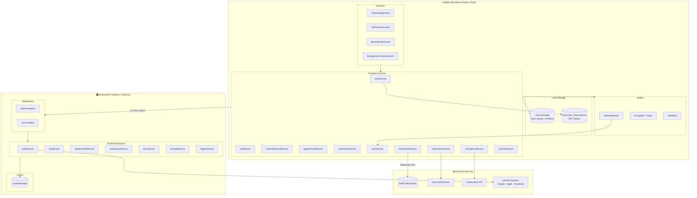
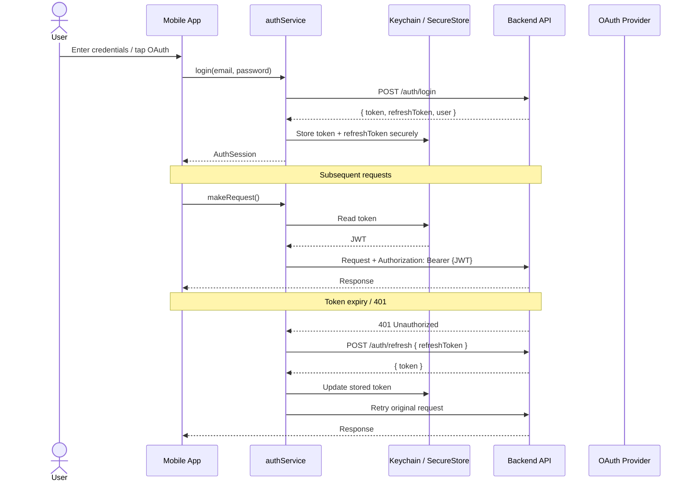
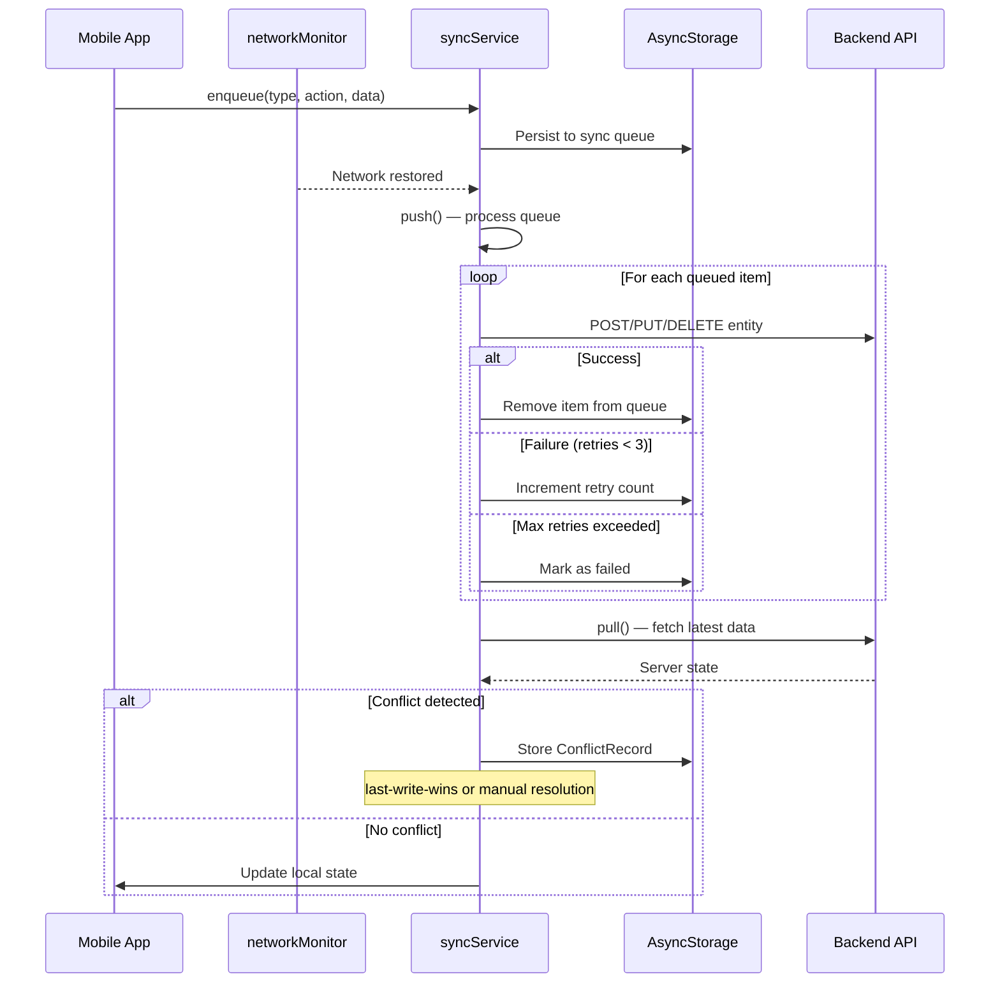
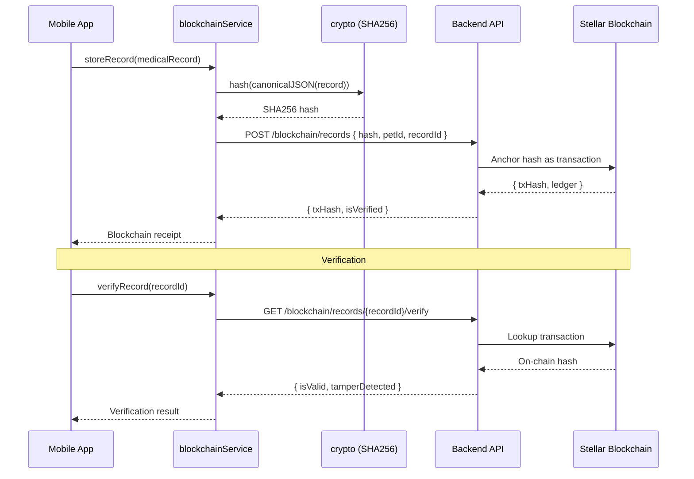
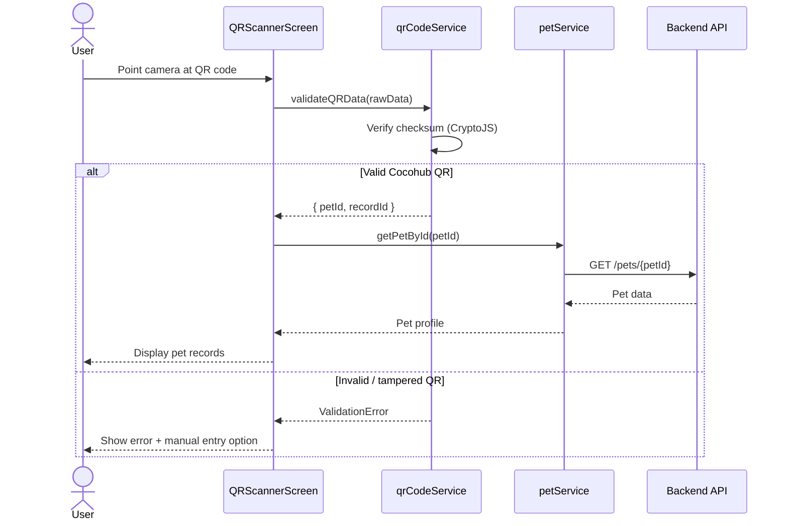
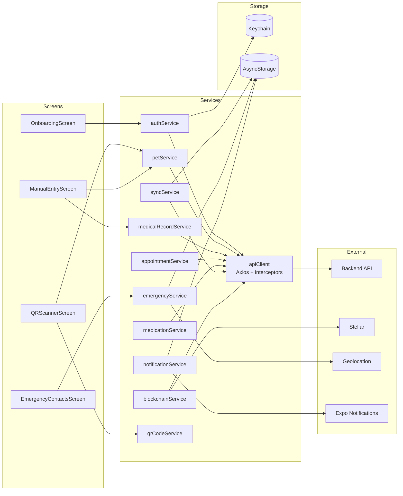
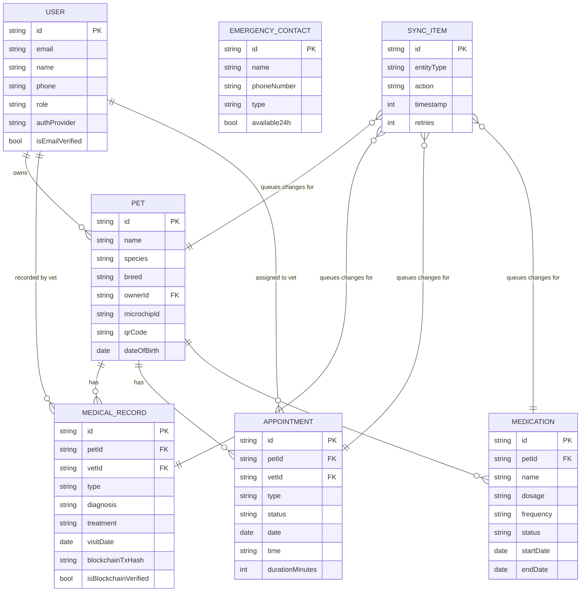
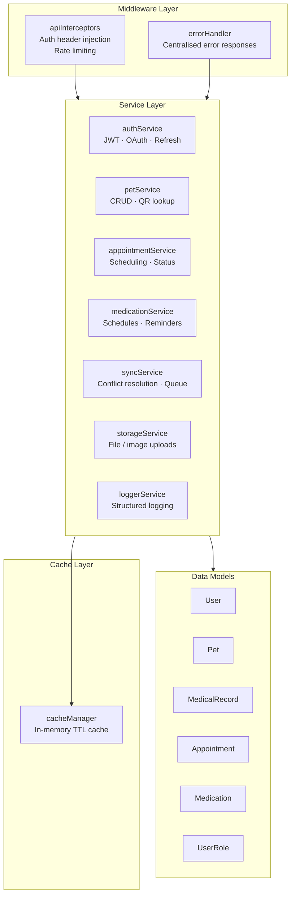

# Cocohub Mobile App — Architecture

This document provides visual diagrams of the Cocohub mobile app architecture, covering the high-level system overview, data flow, and component relationships.

---

## 1. High-Level Architecture



---

## 2. Data Flow Diagram

### 2a. Authentication Flow



### 2b. Offline Sync Flow



### 2c. Blockchain Medical Record Flow



### 2d. QR Code Flow



---

## 3. Component Relationship Diagram

### 3a. Frontend Service Dependencies



### 3b. Data Model Relationships



### 3c. Backend Service & Middleware Structure



---

## 4. Project Directory Structure

```
Cocohub-MobileApp/
├── src/                          # Frontend (React Native)
│   ├── config/                   # Environment config (dev/staging/prod)
│   ├── models/                   # Frontend data models
│   ├── screens/                  # UI screens
│   │   ├── OnboardingScreen.tsx  # App introduction carousel
│   │   ├── QRScannerScreen.tsx   # Camera-based QR scanner
│   │   ├── ManualEntryScreen.tsx # Fallback manual ID entry
│   │   └── EmergencyContactsScreen.tsx  # SOS + nearby clinics
│   ├── services/                 # Business logic & API calls
│   │   ├── apiClient.ts          # Axios instance + JWT interceptors
│   │   ├── authService.ts        # Login, register, token refresh
│   │   ├── petService.ts         # Pet CRUD + QR lookup
│   │   ├── medicalRecordService.ts
│   │   ├── appointmentService.ts
│   │   ├── medicationService.ts
│   │   ├── syncService.ts        # Offline queue + conflict resolution
│   │   ├── blockchainService.ts  # Stellar integration
│   │   ├── emergencyService.ts   # SOS + geolocation
│   │   ├── notificationService.ts
│   │   └── qrCodeService.ts
│   └── utils/
│       ├── encryption/           # Crypto utilities + keychain
│       ├── networkMonitor.ts     # Connectivity detection
│       └── validators.ts
│
└── backend/                      # Backend (Node.js / Express)
    ├── config/                   # Server configuration
    ├── middleware/
    │   ├── apiInterceptors.ts    # Request/response middleware
    │   └── errorHandler.ts       # Centralised error handling
    ├── models/                   # Shared data models / types
    │   ├── User.ts · UserRole.ts
    │   ├── Pet.ts
    │   ├── MedicalRecord.ts
    │   ├── Appointment.ts
    │   └── Medication.ts
    ├── services/                 # Server-side business logic
    │   ├── authService.ts
    │   ├── petService.ts
    │   ├── appointmentService.ts
    │   ├── medicationService.ts
    │   ├── syncService.ts
    │   ├── storageService.ts
    │   └── loggerService.ts
    ├── src/services/
    │   └── cacheManager.ts       # In-memory TTL cache
    ├── types/
    │   └── api.ts                # Shared API request/response types
    └── utils/
        ├── dateUtils.ts
        └── validators.ts
```

---

## Key Architectural Decisions

| Decision | Choice | Rationale |
|---|---|---|
| Blockchain | Stellar | Immutable, tamper-proof medical record anchoring |
| Token storage | Keychain (iOS) / SecureStore (Android) | Device-locked secure storage, not AsyncStorage |
| Offline strategy | Queue-based sync with conflict resolution | Reliable offline-first UX |
| Conflict resolution | Last-write-wins (default) + manual override | Simple default, escape hatch for edge cases |
| QR integrity | CryptoJS checksum | Lightweight tamper detection without full blockchain lookup |
| Auth | JWT + refresh tokens + OAuth | Stateless, supports social login |
| API client | Axios with interceptors | Centralised auth injection and 401 retry logic |
